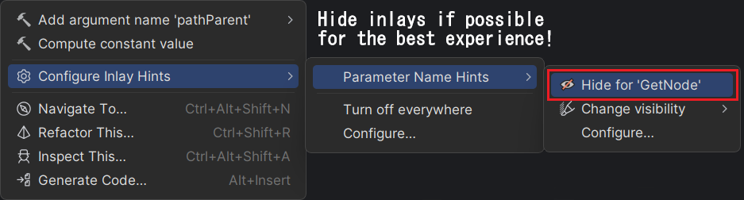

# GodotGetNode


A production-ready Godot 4.x source generator to help you get your nodes!

## Example
```csharp
using Godot;

public partial class MyNode : Node2D {
	// Specify the name of the node
	[GetNode("CoolSprite")] Sprite2D sprite;
    
	// Guess the name based on the default type name ("VBoxContainer" in this case)
	[GetNode] VBoxContainer container;

	// Custom syntax to get a node relative to another node!
	[GetNode(nameof(container), "PanelContainer/Label"] Label relative2;
	// .. or a neater, but type unsafe syntax:
	[GetNode("{container}/PanelContainer/Label"] Label relative1;
    
	public override void _Ready() {
		// No more GetNode<Type>("Name") over here!
	}
}
```

## Note
This repo might seem inactive, but this project works just fine.

I don't update this repo often as it doesn't need any updates, but I've been using it myself in my own Godot projects for about a year now as of the time I'm writing this.

If you do encounter any issues, please [open up an issue or a PR on the repository!](https://github.com/FlooferLand/GodotGetNode/issues)



## Compatibility
_Actively tested for Godot 4.x_

| Version | Godot 3.x | Godot 4.x |
|---------|-----------|-----------|
| 0.1.x   | Likely    | ✔         |
| 0.2.x   | Untested  | ✔         |

## Roadmap
- [x] Optionally allow specifying a variable name to the left of the node path string
	- Example: `[GetNode(container, "PanelContainer/Label"] Label relativeToContainer;`
    - -- There's no neat way of doing this, because of C# its required to use `nameof(..)`
- [ ] A complete rewrite for cleanliness' sake. 
    - [ ] Allow easier user debugging  &  Fix "Cannot access a disposed object" in some rare cases
